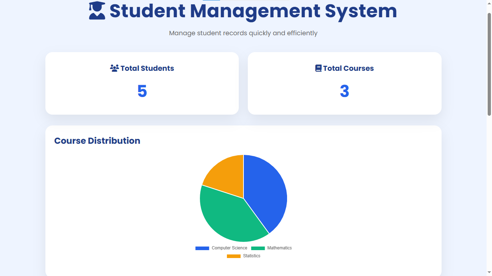
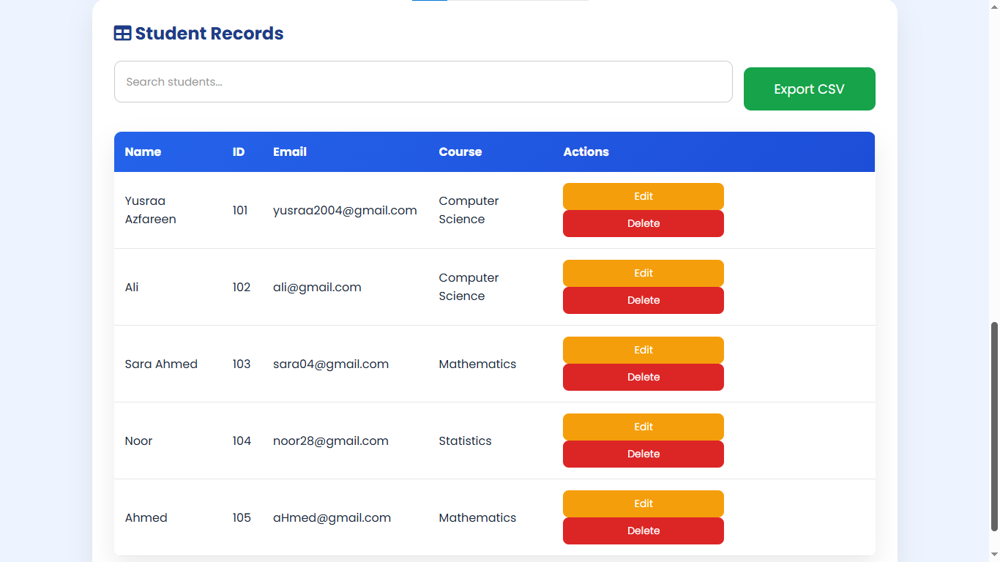
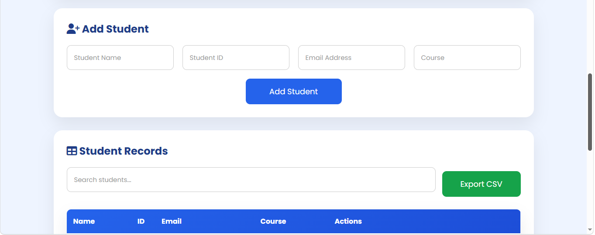

# 🎓 Student Management System

A modern and responsive **Student Management System** built using **HTML5, CSS3, and JavaScript**. This project demonstrates front-end development concepts including CRUD operations, Local Storage, real-time search, dashboard analytics, data visualization, and CSV export.

---

## 🚀 Live Demo

**Coming Soon (GitHub Pages)**

---

## 📸 Screenshots

### Dashboard



### Student Record


### Features


---

## ✨ Features

* ✅ Add new students
* ✅ Edit student records
* ✅ Delete students
* ✅ Store data using Local Storage
* ✅ Live Search (Name, Student ID, Course)
* ✅ Dashboard Statistics
* ✅ Interactive Course Distribution Pie Chart
* ✅ Duplicate Student ID Validation
* ✅ Toast Notifications
* ✅ Export Student Records to CSV
* ✅ Responsive Design
* ✅ Modern UI with Font Awesome Icons

---

## 🛠️ Technologies Used

* HTML5
* CSS3
* JavaScript (ES6)
* Chart.js
* Font Awesome
* Local Storage API

---

## 📂 Project Structure

```text
Student-Management-System/
│
├── index.html
├── style.css
├── script.js
├── README.md
└── screenshots/
```

---

## ⚙️ Installation

Clone the repository:

```bash
git clone https://github.com/Azfareen-Yusraa/Student-Management-System.git
```

Open the project folder and launch **index.html** in your browser, or use **Live Server** in Visual Studio Code.

No backend or installation is required.

---

## 📊 Dashboard Features

The dashboard updates automatically and displays:

* 👨‍🎓 Total Students
* 📚 Total Courses
* 🥧 Interactive Course Distribution Pie Chart

---

## 📤 CSV Export

Export all student records into a **CSV** file compatible with:

* Microsoft Excel
* Google Sheets
* LibreOffice Calc

---

## 📱 Responsive Design

The application is optimized for:

* 💻 Desktop
* 📱 Mobile
* 📟 Tablet

---

## 🎯 Learning Outcomes

This project demonstrates practical knowledge of:

* CRUD Operations
* DOM Manipulation
* Event Handling
* JavaScript Arrays & Objects
* Local Storage
* Responsive Web Design
* Data Visualization with Chart.js
* File Export (CSV)
* UI/UX Design Principles

---

## 🔮 Future Improvements

* 🌙 Dark Mode
* 📷 Student Profile Pictures
* 🔐 User Authentication
* 📄 Pagination
* ↕️ Sorting & Advanced Filters
* 🗄️ Database Integration (MySQL / MongoDB)
* ⚙️ Backend with Node.js & Express

---

## 👩‍💻 Author

**Yusraa Azfareen**

GitHub: https://github.com/Azfareen-Yusraa

Project Repository:

https://github.com/Azfareen-Yusraa/Student-Management-System

---

## ⭐ Show Your Support

If you like this project, please consider giving it a **⭐ Star** on GitHub.

---

## 📄 License

This project is licensed under the MIT License.
