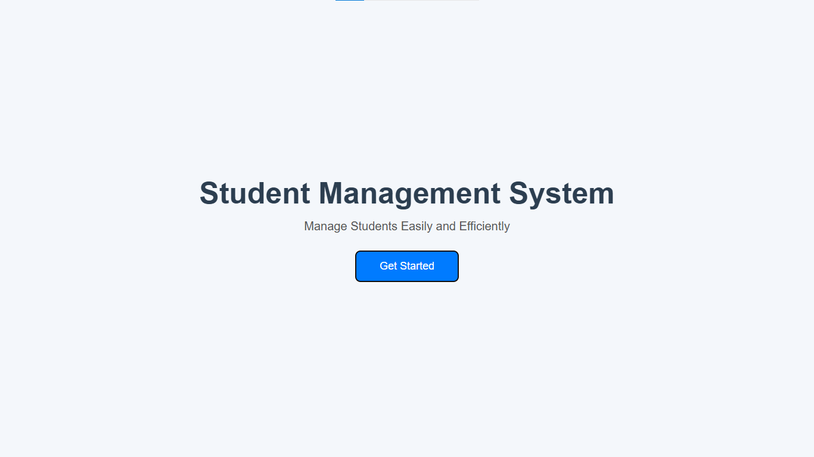

# 🎓 Student Management System

🌐 **Live Demo:** https://azfareen-yusraa.github.io/Student-Management-System/

---
# 🎓 Student Management System

A simple and responsive Student Management System built using HTML, CSS, and JavaScript.

This project demonstrates frontend web development skills including responsive design, DOM manipulation, and clean project organization.

---

## 📸 Project Preview



---

## 🚀 Features

- Modern responsive interface
- Clean user interface
- Interactive "Get Started" button
- Organized project structure
- Easy to customize

---

## 🛠️ Built With

- HTML5
- CSS3
- JavaScript (ES6)

---

## 📂 Folder Structure

```
Student-Management-System/
│
├── assets/
│   ├── icons/
│   └── images/
│
├── screenshots/
│   └── home-page.png
│
├── index.html
├── style.css
├── script.js
├── README.md
└── .gitignore
```

---

## 💻 Installation

Clone the repository

```bash
git clone https://github.com/Azfareen-Yusraa/Student-Management-System.git
```

Open the project folder.

Run `index.html` in your browser or use Live Server in Visual Studio Code.

---

## 🎯 Future Improvements

- Add student registration
- Student database
- Search functionality
- Update student records
- Delete student records
- Local Storage support
- Dark Mode

---

## 👩‍💻 Author

**Yusraa Azfareen**

GitHub:
https://github.com/Azfareen-Yusraa

---

## ⭐ Support

If you like this project, consider giving it a ⭐ on GitHub.